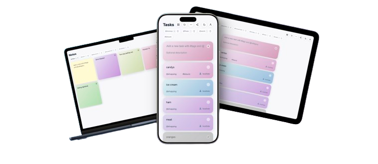

# Toodoom

Toodoom began as a weekend idea after noticing that every simple tasks app had turned into a dashboard for teams. We just wanted a gentle place where my wife and I could share an `@shopping` list, keep track of `@household` fixes, and scribble personal notes. The result is a shareable, offline-first desk that feels like a calm gradient garden. My wife and I use it every day now. Switch between notes and tasks, drop in `#tags`, assign `@categories`, and keep life admin tidy without corporate bloat. Try the hosted demo at [toodoom.vercel.app](https://toodoom.vercel.app/).



<a href="https://buymeacoffee.com/ivucicev"></a>

## Highlights

- ✨ **Dual brain** – maintain boards of tasks _and_ sticky notes in the same app.
- 🏷️ **Smart metadata** – apply `#tags` for instant filtering and `@categories` for lightweight project buckets.
- 🤝 **Shareable lists** – invite a partner, housemate, or family member to any `@category` and stay in sync together (PocketBase-backed).
- 🌙 **Light & dark** – polished themes that automatically remember your preference.
- 📱 **PWA-ready** – install Toodoom on desktop or mobile and run it like a native app.
- 🚂 **Offline-first** – capture tasks and notes without a connection; everything syncs to the server the moment you log in.
- 🧩 **PocketBase inside** – simple auth, realtime updates, and an easy path to self-hosting.
- 🐳 **Self-host friendly** – Docker Compose setup included so you can launch the full stack in one go.

## Table of contents

- [Highlights](#highlights)
- [Architecture](#architecture)
- [Repository layout](#repository-layout)
- [Quick start](#quick-start)
  - [Prerequisites](#prerequisites)
  - [Install](#install)
  - [Run the app](#run-the-app)
- [Configuration](#configuration)
- [Offline workflow](#offline-workflow)
- [Progressive Web App](#progressive-web-app)
- [Self hosting](#self-hosting)
  - [Docker Compose](#docker-compose)
- [Available scripts](#available-scripts)
- [Project status & roadmap](#project-status--roadmap)
- [Contributing](#contributing)
- [License](#license)

## Architecture

Toodoom is an Angular 19 application backed by [PocketBase](https://pocketbase.io/).

```
┌────────────────────┐      ┌──────────────────────────┐
│  Angular frontend  │◄────►│  PocketBase (API + auth) │
│  • Tasks & notes   │  ws  │  • Users & lists         │
│  • PWA shell       │ http │  • Sharing, invites      │
│  • Offline store   │      │  • File storage          │
└────────────────────┘      └──────────────────────────┘
```

- Local data is cached in `localStorage` while offline.
- Once you authenticate, cached tasks/notes/categories are pushed to PocketBase automatically.
- The UI is entirely client rendered and uses Angular Signals for reactive state.

## Repository layout

```
.
|- src/                   # Angular application source
|- public/                # Static assets bundled with the client
|- dist/                  # Production build output (generated)
|- server/                # PocketBase binary, data, hooks, and migrations
|  |- pb_data/
|  |- pb_hooks/
|  |- pb_migrations/
|  `- pocketbase         # Download the PocketBase binary here for local runs
|- docker/                # Dockerfiles for the frontend and API
|  |- dockerfile.client
|  `- dockerfile.api
`- docker-compose.yml     # Docker Compose stack for full local environment
```

## Quick start

### Prerequisites

- Node.js 20+
- npm 10+
- Angular CLI 19 (`npm install -g @angular/cli`)
- PocketBase 0.30+ — download the binary into `server/pocketbase` so you can run it locally. The default config expects the API to be reachable at `http://127.0.0.1:8090`.

### Install

```bash
npm install
```

### Run the app

In one terminal window, start PocketBase from the `server/` folder:

```bash
cd server
./pocketbase serve
```

In another terminal (at the project root), start the Angular dev server:

```bash
npm start
```

Or run the entire stack with Docker (builds the images in `docker/`):

```bash
docker compose up --build
```

Visit `http://localhost:4200` and log in (or register) to begin.

> Default PocketBase super admin credentials are `admin@admin.com` / `admin123`. Update them before deploying by editing the `PB_ADMIN_EMAIL` and `PB_ADMIN_PASSWORD` values in `docker-compose.yml`, or adjust the `ENV` block in `docker/dockerfile.api` if you are building the container directly.

## Configuration

Environment configuration lives in `src/environments/`.

| File | Purpose |
| ---- | ------- |
| `environment.ts` | Default development settings. |
| `environment.prod.ts` | Production build overrides. |
| `environment.hosted.ts` | Production build for self-hosted instances. |

The only required variable today is the PocketBase API endpoint:

```ts
export const environment = {
  production: false,
  api: 'http://127.0.0.1:8090'
};
```

Adjust these values before building for production.

## Offline workflow

1. Create notes and tasks while offline — Toodoom stores everything locally.
2. When a network connection or user session becomes available, local content is synced back to PocketBase automatically (lists, note lists, tasks, and notes).
3. The local cache is cleared after a successful sync, ensuring you never double-import data.

## Progressive Web App

Toodoom ships with Angular Service Worker support. Install it like any modern PWA:

- Open the app in Chrome, Edge, or Safari.
- Click “Install” (desktop) or “Add to Home Screen” (mobile).
- Enjoy the same gradient goodness offline.

You can adjust caching behaviour in `ngsw-config.json`.

## Self hosting

PocketBase makes it straightforward to self-host the backend. Deploy the Angular frontend through Vercel, Netlify, static hosting, or your own server.

### Docker Compose

A ready-to-run stack lives in `docker-compose.yml` and references the Dockerfiles in `docker/`.

```bash
docker compose up --build
```

The command above builds both containers, serves the Angular app on `http://localhost:4200`, and exposes PocketBase on `http://127.0.0.1:8090`. PocketBase state persists in `server/pb_data`, so feel free to stop and restart the stack without losing records.

- **Admin credentials** – the Docker images create a super admin with `admin@admin.com` / `admin123` by default. Change these credentials by updating the `PB_ADMIN_EMAIL` and `PB_ADMIN_PASSWORD` environment variables in `docker-compose.yml`, or edit the `ENV` values inside `docker/dockerfile.api` when building a standalone image.

## Available scripts

| Command | Description |
| ------- | ----------- |
| `npm start` | Run the dev server with live reload. |
| `npm run build` | Create build inside `dist/`. |
| `npm run build-prod` | Create a production build inside `dist/`. |
| `npm run build-hosted` | Create a production build for self hosted inside `dist/`. |
| `npm run watch` | Rebuild on file changes (development configuration). |
| `npm test` | Execute unit tests via Karma/Jasmine. |

## Project status & roadmap

- [x] Notes and tasks with gradients, tags, and categories
- [x] Category sharing via PocketBase invites
- [x] Offline cache + auto-sync on login
- [x] Dark/light theme toggle
- [x] PWA install support
- [x] Docker Compose deployment bundle
- [ ] SqlLite, IndexDB instead of localstorage for offline data
- [ ] Rich text for notes (will reduce simplicity)
- [ ] Electron build so it can run on macOS and Windows
- [ ] Notepad tab - to scrible longer notes

## Contributing

Issues, fixes, and improvements are warmly welcomed. Please:

1. Fork the repository.
2. Create a feature branch: `git checkout -b feat/amazing-idea`.
3. Commit with context.
4. Open a pull request describing the change.

## License

This project is released under the MIT License. See `LICENSE` for details.
